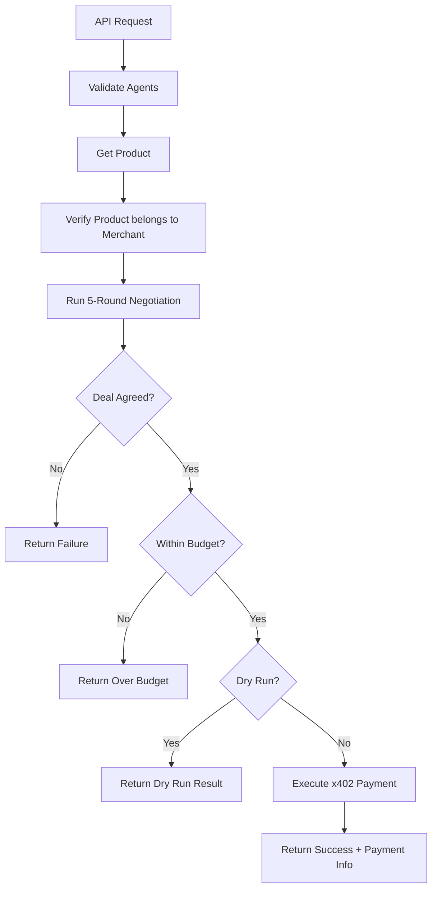

# Single Negotiation Endpoint Documentation

## Overview

The `/negotiation/single-negotiation` endpoint enables direct negotiation between a specific client and merchant agent with automatic payment execution upon successful deal.

## Endpoint

```
POST /negotiation/single-negotiation
```

## Request Body

```json
{
  "client_agent_id": "uuid-string",
  "merchant_agent_id": "uuid-string",
  "product_id": "uuid-string",
  "budget": 100.50,
  "rounds": 5,          // Optional, default: 5
  "dry_run": false      // Optional, default: false
}
```

### Parameters

- **client_agent_id** (string, required): UUID of the client agent (buyer)
- **merchant_agent_id** (string, required): UUID of the merchant agent (seller)
- **product_id** (string, required): UUID of the product to negotiate
- **budget** (float, required): Maximum budget the client is willing to pay
- **rounds** (integer, optional): Number of negotiation rounds (default: 5)
- **dry_run** (boolean, optional): If true, skips actual payment execution (default: false)

## Response

```json
{
  "status": "completed_with_payment",
  "client_agent_id": "uuid-string",
  "merchant_agent_id": "uuid-string",
  "product_id": "uuid-string",
  "product_name": "Playstation 5",
  "initial_price": 0.50,
  "final_price": 0.35,
  "agreed": true,
  "negotiation_rounds": 1,
  "negotiation_history": [
    {
      "merchant": "Merchant_a42d17b3",
      "price": 0.35,
      "product": "Playstation 5",
      "status": "AGREED",
      "final_message": "I accept your offer..."
    }
  ],
  "payment_result": {
    "status": "success",
    "transaction_hash": "0x...",
    "settlement_address": "0x...",
    "amount_paid": 0.35,
    "protocol_fee": 0.00875,
    "evidence_cid": "Qm...",
    "cart_id": "cart_..."
  },
  "error": null
}
```

### Status Values

- **completed_with_payment**: Negotiation successful, payment executed
- **negotiation_success_payment_failed**: Deal agreed but payment failed
- **negotiation_success_over_budget**: Deal agreed but price exceeds budget
- **negotiation_success_dry_run**: Dry run mode, payment skipped
- **negotiation_failed**: No agreement reached
- **completed**: Negotiation completed (generic)

## Flow



## Example Usage

### cURL

```bash
curl -X POST http://localhost:8000/negotiation/single-negotiation \
  -H "Content-Type: application/json" \
  -d '{
    "client_agent_id": "02fa72bb-cc9e-4895-b3ed-11c63a9cebbb",
    "merchant_agent_id": "a42d17b3-8cc4-40ac-9ddb-c5a36de1ff10",
    "product_id": "550e8400-e29b-41d4-a716-446655440000",
    "budget": 0.50,
    "rounds": 5
  }'
```

### Python

```python
import requests

response = requests.post(
    "http://localhost:8000/negotiation/single-negotiation",
    json={
        "client_agent_id": "02fa72bb-cc9e-4895-b3ed-11c63a9cebbb",
        "merchant_agent_id": "a42d17b3-8cc4-40ac-9ddb-c5a36de1ff10",
        "product_id": "550e8400-e29b-41d4-a716-446655440000",
        "budget": 0.50,
        "rounds": 5
    }
)

result = response.json()
print(f"Status: {result['status']}")
if result.get('payment_result'):
    print(f"Payment TX: {result['payment_result']['transaction_hash']}")
```

### JavaScript

```javascript
const response = await fetch('http://localhost:8000/negotiation/single-negotiation', {
  method: 'POST',
  headers: { 'Content-Type': 'application/json' },
  body: JSON.stringify({
    client_agent_id: '02fa72bb-cc9e-4895-b3ed-11c63a9cebbb',
    merchant_agent_id: 'a42d17b3-8cc4-40ac-9ddb-c5a36de1ff10',
    product_id: '550e8400-e29b-41d4-a716-446655440000',
    budget: 0.50,
    rounds: 5
  })
});

const result = await response.json();
console.log('Status:', result.status);
if (result.payment_result) {
  console.log('Payment TX:', result.payment_result.transaction_hash);
}
```

## Testing

### Test Script

```bash
# Auto-select agents and products
python scripts/test_single_negotiation.py --budget 0.5

# Specify exact agents and product
python scripts/test_single_negotiation.py \
  --client-agent-id 02fa72bb-cc9e-4895-b3ed-11c63a9cebbb \
  --merchant-agent-id a42d17b3-8cc4-40ac-9ddb-c5a36de1ff10 \
  --product-id 550e8400-e29b-41d4-a716-446655440000 \
  --budget 0.5

# Dry run (skip payment)
python scripts/test_single_negotiation.py \
  --budget 0.5 \
  --dry-run

# Custom rounds
python scripts/test_single_negotiation.py \
  --budget 1.0 \
  --rounds 10
```

## Requirements

### Database

- Both agents must exist in `agents` table
- Client agent must have `agent_type = 'client'`
- Merchant agent must have `agent_type = 'merchant'`
- Product must exist in `products` table
- Product's `agent_id` must match `merchant_agent_id`
- Both agents must have encrypted `private_key` in database

### Wallets

- Client wallet must have USDC for payment
- Both wallets must have ETH for gas fees
- Wallets are managed via ChaosChain SDK

### Environment

```env
SUPABASE_URL=your_supabase_url
SUPABASE_SERVICE_ROLE_KEY=your_key
OPENAI_API_KEY=your_openai_key
USER_SECRET_KEY=your_encryption_key
```

## Payment Integration

The endpoint uses the fixed ChaosChain payment flow (see `docs/PAYMENT_FIX_SUMMARY.md`):

1. Merchant SDK creates `x402_payment_request`
2. Client SDK's `wallet_manager` is monkey-patched
3. PaymentManager called directly (bypasses buggy A2A extension)
4. Payment flows: Client → Merchant ✅
5. On-chain verification confirms recipient

## Error Handling

### Common Errors

```json
{
  "detail": "Client agent {id} not found"
}
```

```json
{
  "detail": "Merchant agent {id} is not a merchant agent"
}
```

```json
{
  "detail": "Product {id} does not belong to merchant {id}"
}
```

```json
{
  "detail": "Invalid agent_id format: {id}"
}
```

### Payment Errors

If payment fails, the response will include:

```json
{
  "status": "negotiation_success_payment_failed",
  "agreed": true,
  "final_price": 0.35,
  "payment_result": {
    "status": "error",
    "error": "Insufficient USDC balance: 0.0 < 0.35"
  }
}
```

## Monitoring

### Logs

```python
# Negotiation start
logger.info(f"Starting single negotiation: Client {client_id} ↔ Merchant {merchant_id}")

# Payment execution
logger.info(f"Executing payment for negotiated price: ${price:.2f}")

# Success
logger.info(f"✅ Payment successful: TX {tx_hash}")

# Failure
logger.error(f"Error in single_negotiation endpoint: {error}")
```

### Verification

Check transaction on Base Sepolia:
```
https://sepolia.basescan.org/tx/{transaction_hash}
```

Verify USDC Transfer event:
- **From:** Client address
- **To:** Merchant address ✅

## Related Documentation

- **Payment Fix:** `docs/PAYMENT_FIX_SUMMARY.md`
- **Quick Start:** `docs/QUICK_START_PAYMENTS.md`
- **ChaosChain SDK:** `docs/chaoschain_a2a_payments.md`
- **Multi-Product:** `docs/negotiation_storage_summary.md`

## Comparison with `/negotiate-and-pay`

| Feature | `/single-negotiation` | `/negotiate-and-pay` |
|---------|----------------------|---------------------|
| Agent Selection | Specific agents | Auto-select from products |
| Product Query | Exact product ID | Search query |
| Multi-Product | No | Yes |
| Best Offer Selection | N/A | Automatic |
| Use Case | Direct deal | Product search |

---

**Created:** November 23, 2025  
**Status:** ✅ Production Ready  
**Version:** 1.0

